2026年6月8号，我拍了毕业照。

照片上的我时而蠢萌，时而搞笑，时而眉头微微皱着，挂着一股子不知道从哪里冒出来的忧虑。

但那一天，我是真的很开心。

大学四年，遇到了不少人，结交了不少好朋友，也经历过不少挫折和挑战。有些事情做得并不好，有些时间确实被我浪费掉了，有些人曾经离我很近，最后也还是慢慢走出了彼此的生活。

直到现在，我偶尔还是会觉得自己挺烂的。

懒、拖延、优柔寡断、胡思乱想、多情；有时候自卑得要死，有时候又莫名其妙地傲慢。

但不知道为什么，我还是一直相信：

我大概还能再努力一点。

再往前走一点。

再给自己的人生，添上几分恣意。

  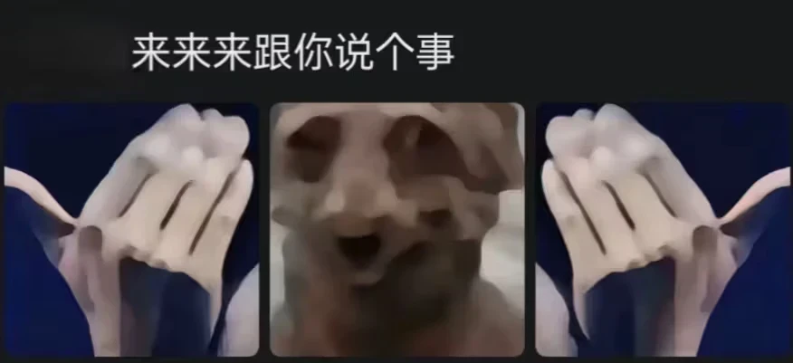

来来，跟你说个事。

---

## 一、2022：从一个连 `=` 和 `==` 都分不清的人开始

2022年，高考终于结束。

那种感觉是真的爽，像是被关了三年以后突然放出来了一样。

于是那个暑假，我狠狠爽玩了两个月的原神。现在回头看，那真是一段特别轻松惬意的日子：每天最大的烦恼，可能只是今天干什么、游戏打到几点。

以后的人生当然也还会有这么轻松的时候。

只不过，不多。

九月份，我跟着老爹坐上大巴，第一次进城里上大学。那个时候的我青涩得有点笨拙，拖着行李到了西三218，也在那里认识了大学四年最早的一批同行者：

hp、阿伟、席少……

一个新的世界，就这么稀里糊涂地打开了。

  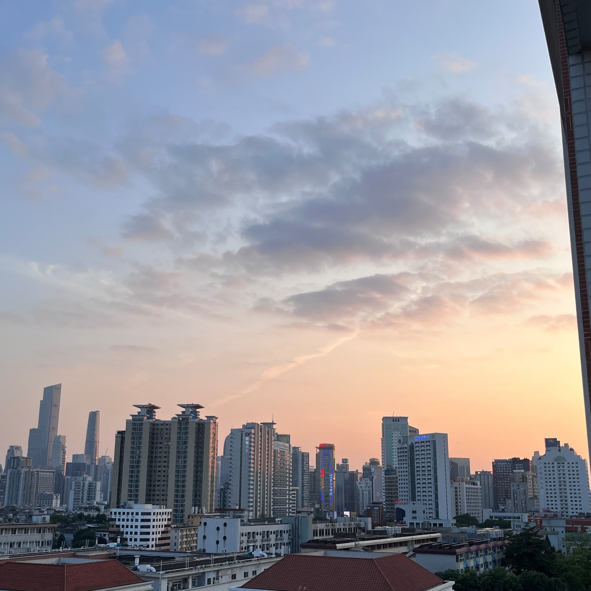

大一某一天的晚霞 · 那时候还觉得四年很长。

刚学计算机的时候，我其实学得很吃力。

现在印象最深刻的一件事，甚至不是什么特别困难的算法，而是：

我一开始居然分不清 Python 里的 `=` 和 `==` 到底有什么区别。

现在当然觉得这件事蠢得有点可爱。

但当时的我是真的焦虑。

为什么别人好像听一下就能理解？

为什么老师讲一遍，他们就能写？

为什么我坐在那里，脑子里却一直是一团浆糊？

那大概是我大学里第一次真正地否定自己。我会觉得，是不是我就是个大笨蛋，是不是我根本不适合学计算机，是不是别人轻易就能做到的事情，我就是做不到。

十八九岁的我还不知道，学习一件新东西本来就是需要时间的。

那个时候我只知道：

别人会。

我不会。

所以一定是我不够聪明。

---

大一那一年，我还兴致勃勃地加入了院学生会和校新闻社。

现在想起来，那时候的我真的什么都想去试一试。也正是在这些地方，我认识了许多后来会在我的大学里留下痕迹的人。

其中当然也包括我的前女友。

现在回头看，那时候的我其实还没有学会应该怎样真正地喜欢一个人。

我不擅长聊天，不擅长表达，也不太懂得怎样认真听别人讲话，更不知道应该怎样理解一个女孩子那些没有直接说出口的情绪。

她曾经跟我说过自己原生家庭的一些事情。

那时候我第一次很清晰地意识到：

我好像没有自己想象中的那么厉害。

我不知道该怎么安慰她，不知道怎么帮她，甚至不知道自己到底能为她做什么。

于是我开始不停攻击自己。

我觉得自己不够成熟、不够有趣、不够会照顾人，也不够懂她。然后带着这种“我不够好”的心态继续和她相处：

一边喜欢。

一边自卑。

一边焦虑。

一边又不知道怎样真正靠近一个人。

最后，以一种嘉豪般的方式草草收场（。

现在再回头看，那时候很多事情我当然做得不好。但十八九岁的人第一次真正进入一段感情，好像本来就很难做到滴水不漏。

只是当时的我不懂。

我只会觉得：

完了。

我把一切都搞砸了。

---

也差不多从那个时候开始，我慢慢进入了一段摆烂期。

逃课、打游戏，学校里的事情做完以后就开摆。

尽管在外人看来，我好像还在为成绩奔波，还会参加活动、参加比赛、做项目，但我自己知道：

我是真摆。

就算偶尔努力，也经常努力错了方向。

游戏变成了一个特别容易躲进去的地方。很多人、很多事情，也就在这种日复一日的沉迷里慢慢离我远去。

不过，大一当然也不是一无是处。

我认识了圈圈，一个努力起来能够对自己超级狠的人；也经历了很多大学里的第一次。

第一次真正做项目。

第一次参加社团。

第一次恋爱。

第一次发现自己其实没有想象中那么厉害。

也是第一次开始意识到：

大学和高中，好像真的完全不是一回事。

---

## 二、2023—2024：恐怖老师、比赛，以及被推着往前走的一年

大二那年，我最深刻的印象就是：

课好多。

真的好多。

尤其是黄老师的数据结构，还有后来那门让人头皮发麻的编译原理。

真的吓人 hhhhhh。

那时候我的学习方式其实还很原始，基本就是：

老师讲。

我听。

然后努力听懂。

耐听王是吧（。

课后真正主动钻研的习惯，其实还没有建立起来。

但也就是从那一年开始，我参加了大创、金种子、数模等各种项目和比赛。

我身边好像总有一群很努力的人。

大家会认真讨论，认真准备，是真的想把事情做好，也是真的想拿一个不错的结果。

而我有时候会觉得自己像一滩烂泥：

旁边的人都想把我扶起来。

我还在那里边打游戏边学习（。

但现在回头看，我也不愿意真的把那一年完全归结成“摆烂”。

因为那些项目和比赛至少第一次让我意识到：

计算机不是只有课本。

也不是只有考试。

一个问题真的可以被拆开，可以查资料，可以试，可以写，可以改，最后真的把一点东西做出来。

即便那些成果现在看来很稚嫩，甚至很多东西谈不上多高的技术含量，但对当时的我来说，它们确实是一扇扇门。

---

大一的时候，我还跟着曾老师做过一个项目。

当时会觉得：

卧槽。

我大一就开始做项目了。

我是不是很牛逼？

后来再一看，其实就是一个技术含量没有多高的 Web 项目。

而且居然还是 PHP！！

hhhhhhhh。

但后来我反而不太愿意嘲笑那段经历了。

因为对现在的我来说，它也许很简单；但对那个连 `=` 和 `==` 都还没完全搞明白的自己来说，它已经是一扇很重要的门。

至少它第一次让我知道：

原来代码不是只能写在作业里。

它是真的能够组合成一个东西、跑起来、被别人使用的。

那已经够了。

---

至于黄老师……

就是前面那个恐怖老师。

他是真的严格。

  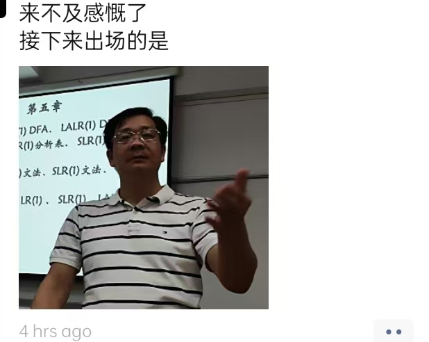

黄老师：没收你的学位证。

严格到不少同学对他的印象都不算特别好。

当时会觉得：

哥们，有必要吗？

但是很奇怪。

几年过去以后，反而是这种老师最容易被记住。

大二通过他的数据结构课程时，我是真的有一种：

**“哈哈哈哈哈哈老子活下来了！”**

的快乐。

现在想想，这居然也算大学四年最开心的瞬间之一。

---

大学里对我影响比较大的老师，还有一位 bt 老师。

他给我的影响和黄老师不太一样。

很多东西，我当时其实并没有真正意识到。他讲的一些思考方式、做事情的方法，还有当时给我们的帮助和指导，现在回头看，甚至有一点超前。

大一大二的时候听那些东西，我可能只是觉得：

“哦，好像有点道理。”

甚至有些时候，压根没有真正放在心上。

等到了大三大四，开始自己做项目、准备考研、考虑以后到底要去哪里、要做什么的时候，我才慢慢发现：

**卧槽，他好像很早以前就在提醒我们这些事情了。**

怎么去思考一个问题。

怎么避免只盯着眼前的答案。

怎么养成好的思维习惯。

怎么真正对自己正在做的事情负责。

很多话当时听起来只是老师随口说说，几年以后却会突然从脑子里冒出来。然后你才意识到：

原来当时不是完全没听懂。

只是那个时候的自己，还没有走到真正能够理解这些话的位置。

我还被他骂过一句：

**“你太菜了吧。”**

hhhhhh。

如果换成以前的我，可能会因为这种话怀疑自己很久：

是不是老师看不起我？

是不是我真的特别笨？

但很奇怪，我并没有因此特别讨厌他。

反而一直记着这句话。

因为现在回头看，我觉得它更像一次警醒。

菜就是菜。

不会就是不会。

有问题就去补。

与其花时间想：

“别人是不是觉得我很差？”

不如问：

“那我到底还差在哪里？”

这句话后来慢慢变成了另外一种提醒：

**你得开始为自己负责了。**

老师可以提醒你。

同学可以帮你。

父母可以替你操心。

但是没有人能够替你把未来活完。

学不会的东西，最后还是得自己学；做不好的事情，最后还是得自己改；不知道以后要干什么，也不能永远等着别人给答案。

所以后来每当我觉得自己又在摆烂、拖延、逃避的时候，偶尔还是会想起那句：

“你太菜了吧。”

多少有点扎心。

但也挺有用。

菜就菜吧。

**那就练呗。**

---

## 三、大三：人生好像真的要自己选了

到了大三以后，我对自己的不满越来越明显。

因为大学已经过去一半了。

大一还能说：

我刚来。

大二还能说：

课程太多。

到了大三，再回头看，就很难继续安慰自己。

我有时候会突然意识到：

卧槽。

大学已经过去两年了。

那我到底真正会什么？

这种感觉其实挺吓人的。

因为“毕业”“考研”“工作”“实习”这些以前听起来特别遥远的词，突然开始一点一点靠近。

也是从那个时候开始，我慢慢意识到：

仅仅把学校课程应付过去是不够的。

比起：

“这门课我考了多少分？”

我开始更想知道：

**“我到底能不能真正做出一些东西？”**

---

大三比较重要的一件事，是编译原理课程设计。

这门课其实真的挺有意思。

当然。

还是黄老师。

还是严格。

还是压力值拉满 hhhhhh。

我做得其实并不算特别好。

该不会的时候还是不会。

该痛苦的时候还是痛苦。

中间各种折腾，最后勉勉强强把课程设计做完，也算过了。

现在再回头看编译原理，反而觉得这门课很有意思。

以前我总觉得，真正适合自己的知识应该是：

老师一讲，我就懂。

我一写，就会。

后来才慢慢发现，好像很多真正有意思的东西恰恰就是：

一边折磨你。

一边让你忍不住觉得：

妈的。

这玩意怎么还有点意思。

---

## 四、考研：晚上十点的星空、APEX，以及“不回家搞鸡毛去了”

大三往后，还有一个越来越无法绕开的东西：

考研。

  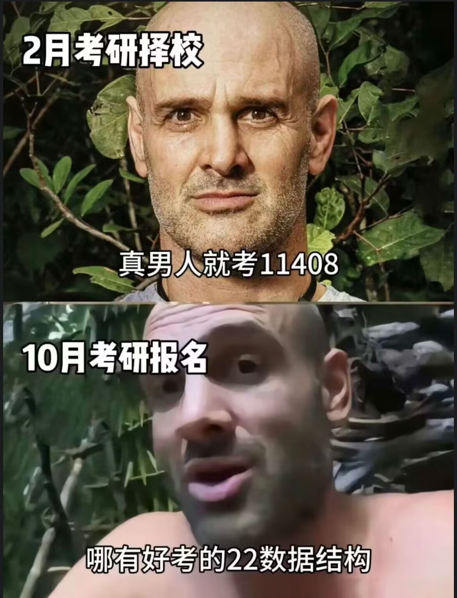

考研初期 · 信心满满。

如果现在让我评价那段备考，我大概不会美化它。

我备考得其实并不算特别好。

最后能够考上，我自己都有一种：

好像多少有点擦线混过去了。

的感觉。

别人写考研回忆，可能会说：

每天六点起床。

十二点睡觉。

坚持三百天。

风雨无阻。

  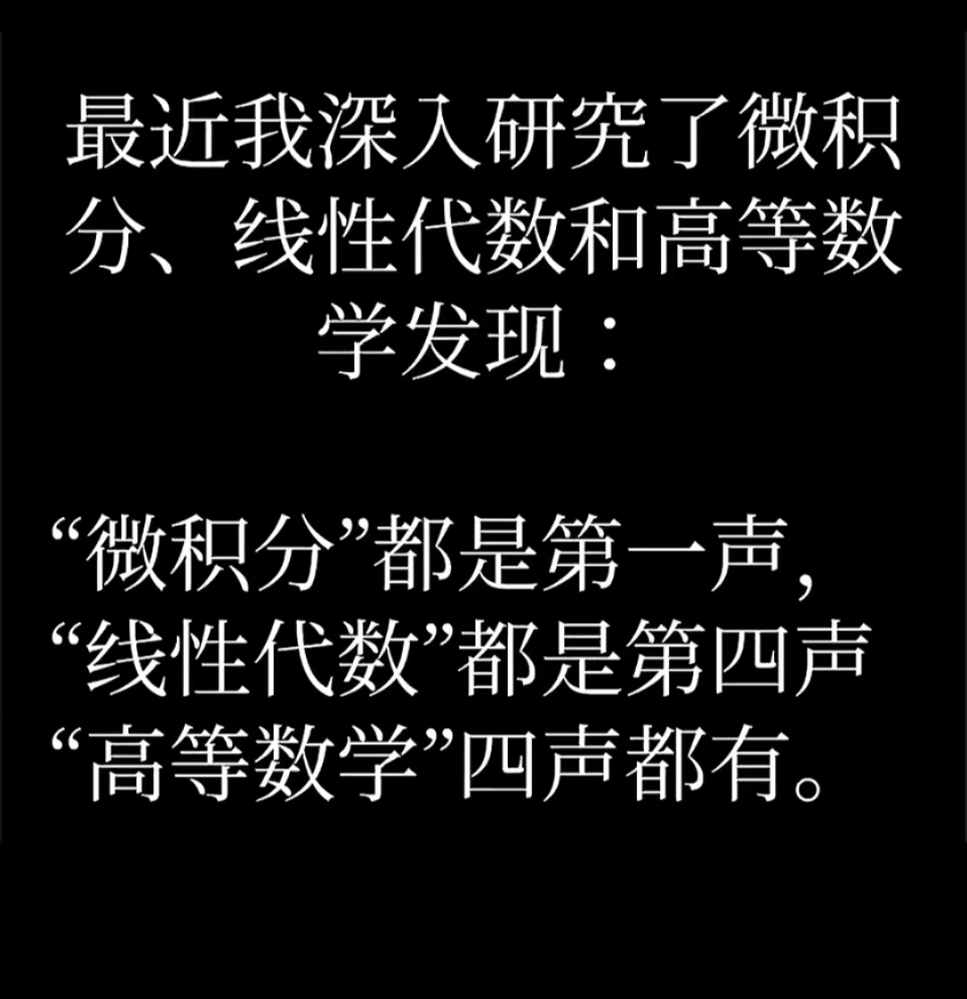

刚学高数三个月的精神状态 belike。

我的版本可能更像：

学习。

焦虑。

打游戏。

继续学习。

再焦虑。

偶尔摆烂。

然后再学一点。

hhhhhh。

  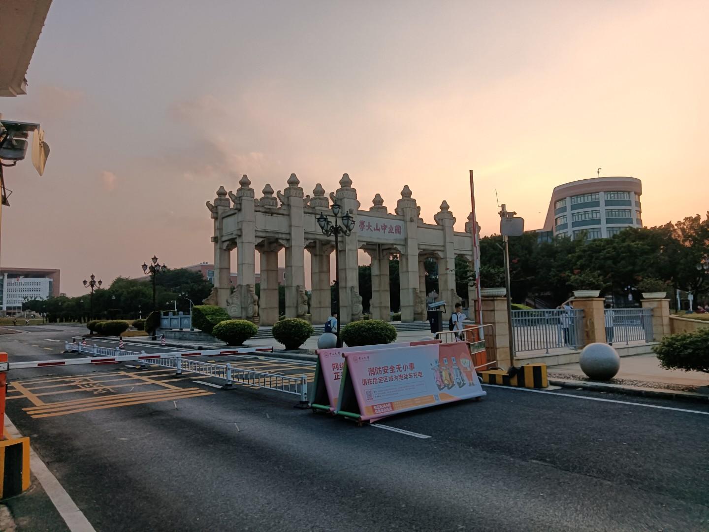

考研初试结束，离开考场的时候 · 中大好美。

但也正是在这样一个并不完美的备考过程里，留下了很多我现在特别喜欢的记忆。

---

我会跟着圈圈一起备考。

晚上十点，从学习的地方出来，走在校园里。

头顶是一片星空。

  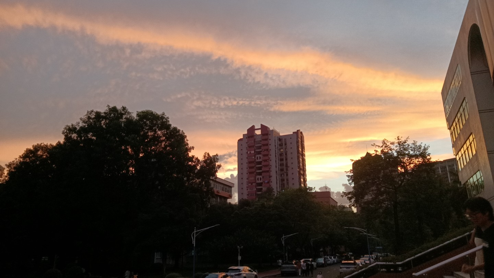

备考期间从图书馆出来看到的晚霞。

大家都很累，也都不知道最后会去哪。

不知道考试结果怎么样。

不知道未来到底是什么样子。

但还是一起往宿舍走。

以前觉得晚上十点只不过是一个普通时间。

毕业以后再回头想，那片星空反而成了我大学里最清晰的一幅画。

---

还有波波。

他是一个挺腼腆的人，不算特别外向，但人真的很善良。

考研期间我们会一起谈天说地。

说未来。

说学习。

说生活。

说一些有的没的东西。

具体说过什么，现在已经想不起来很多了。

但我记得那种感觉。

几个人一起往前走，嘴里讲着乱七八糟的话。大家其实都很迷茫，但因为旁边还有人，所以迷茫好像也没有那么可怕。

---

考研那年的暑假，我没有回家。

  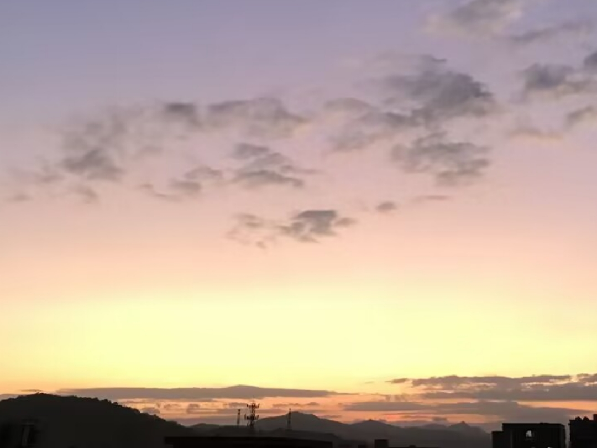

家乡的晚霞

我爸妈还在家里问：

“你搞鸡毛去了？”

hhhhhh。

当时我其实挺难受的。

因为我会觉得他们不太理解我的处境。

为什么不回去？

为什么非得留在那里？

为什么一定要把自己搞得这么辛苦？

其实很多时候，我自己也解释不清楚。

我只是隐约知道：

我必须继续待在那里。

我必须继续做点什么。

我不能什么都不做，然后希望未来有一天自己从天上掉下来。

---

也就是在那段时间，我重新打开了曾经特别喜欢的 APEX。

这件事现在想起来还挺好笑的。

都考研了。

还玩。

但我真的重新喜欢上了它。

我重新想起以前自己一个人在风暴点里到处跑的日子。

  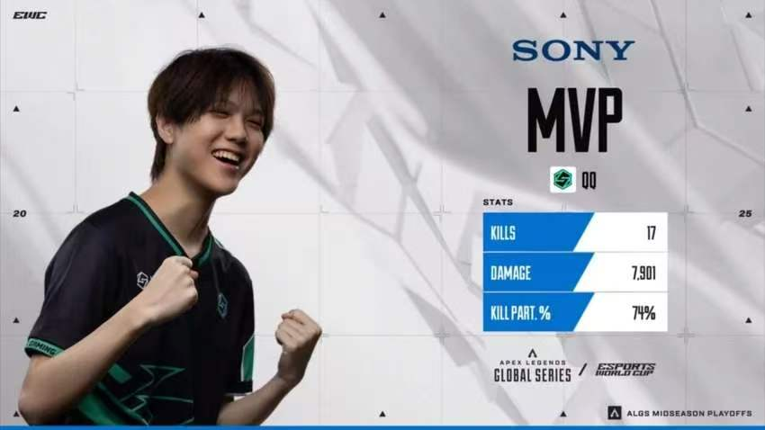

欸，怎么一觉醒来 CNAPEX 就拿冠军了？！我 huge 呢。

现实里每天都是数学、英语、政治、专业课。

一道又一道题。

一页又一页书。

但是游戏一打开，我好像又能够暂时变成那个拿着枪在地图里乱窜的人。

现在想想，人可能真的需要给自己留一点缝隙。

现实太挤的时候，从那里钻出去喘口气。

APEX 大概就是我那时候的一条缝。

  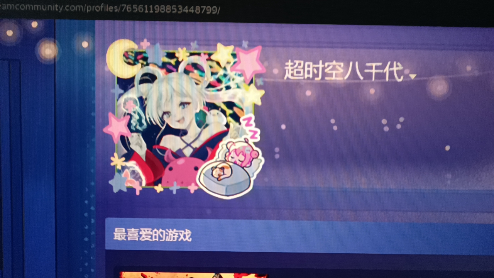

我的 Steam 个人资料 · 永远喜欢超时空八千代！

当然。

钻进去不出来的话。

也是会寄的（。

  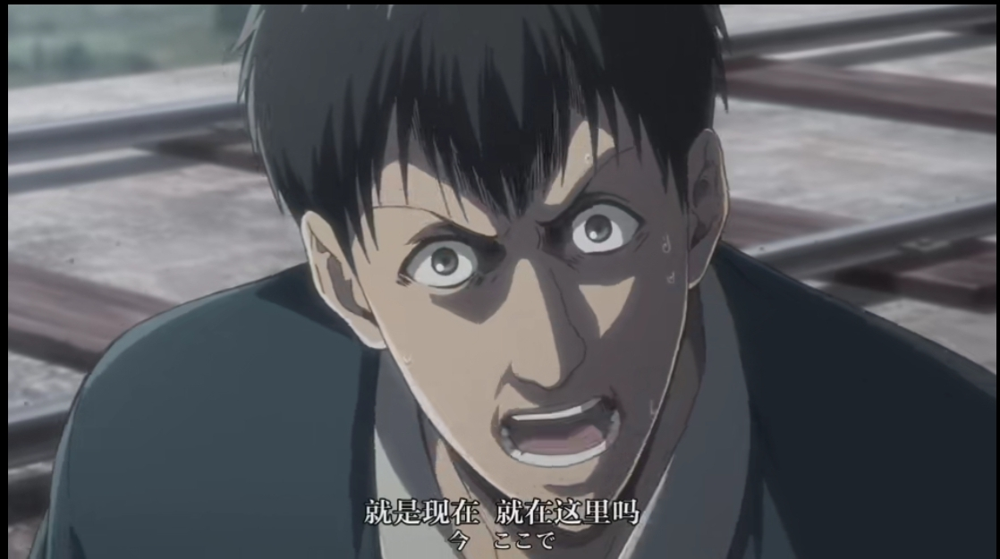

真的要在派派继续度日吗！？快去学习！

---

考研期间，我温柔的妹妹也一直挺关心她哥。

虽然她问的数学问题，经常会把她哥整得头大。

有时候看到她发来的题，我脑子里的第一反应可能是：

“你这又是什么鬼东西？？？”

然后还是得坐下来给她看。

现在回头想，这种事情其实挺幸福的。

家人之间很多时候不会真的有什么电视剧里轰轰烈烈的桥段。

所谓关心，大概就是：

她突然发来一道数学题。

问：

“哥，这个怎么做？”

你嘴上嫌麻烦。

然后还是低头开始算。

可能就是这样。

  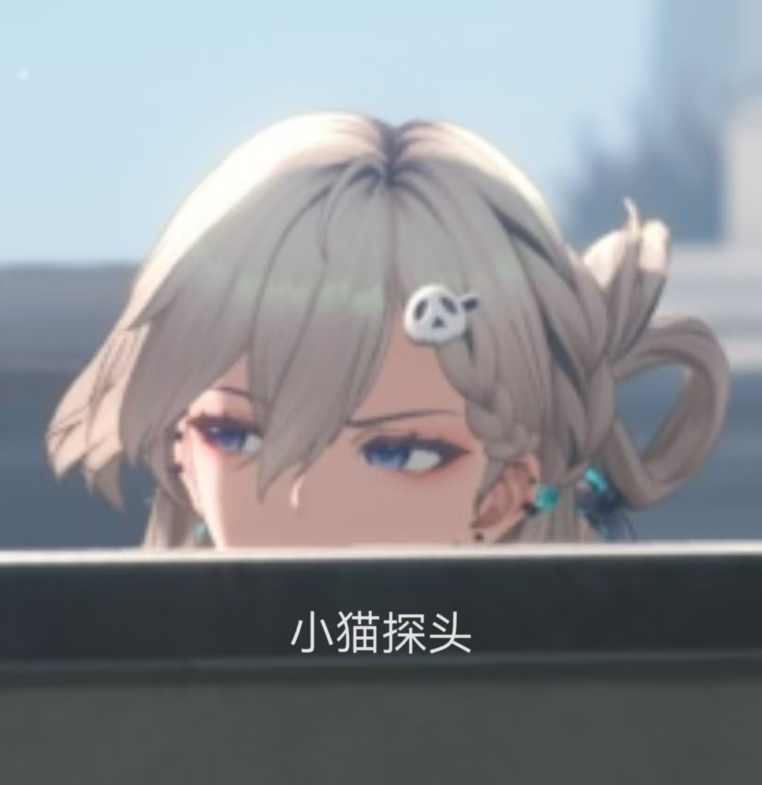

我妹找我问问题belike👆

---

## 五、那些人

大学四年里，我遇到了很多人。

有的人陪我走了很久。

有的人只在我的青春里晃了一下。

现在回想起来，我反而越来越觉得：

一个人对你的影响，有时候根本不需要通过什么惊天动地的大事。

可能只是每天一起吃饭。

一起讲话。

一起上课。

然后你就慢慢被改变了。

---

比如邓同学和阿伟。

他们是大学里对我影响很大的两个舍友。

和他们相处以后，我第一次真正意识到：

**好好思考，本身就是一种特别厉害的能力。**

以前的我其实挺傲慢。

当然现在也还有一点（。

我会因为别人的某个生活习惯而不喜欢他，因为别人说了一句话就觉得他很蠢，因为某个观点和我不一样，就在心里迅速给别人下判断。

跟他们相处久了以后，我才慢慢发现：

很多事情并不是我第一眼看到的那么简单。

别人为什么这样想？

为什么这样说？

是不是我根本没听完？

是不是我只是站在自己的位置上，就觉得自己看到了全部？

慢慢地，我开始收敛自己的傲慢和偏见。

学着理解别人。

学着认真思考。

也学着在别人说话的时候，不要一直想着下一句自己要怎么反驳，而是真的把别人讲的话听进去。

当然，直到最后，有些事情我还是做得不够好，也留下过一些疙瘩。

不过……

以后这不就是一顿饭就能解决的事嘛 👉👈

一顿不够的话。

那就两顿。

---

大学里还有一个很自律的女生。

她很认真，也特别自律。

认真到现在想起来，我都会莫名觉得自己当时多少有点蠢。

尤其是以前的我，有时候还会带着一股子自认为很幽默的气质去见她。

现在重新回忆：

所谓幽默。

本质嘉豪。

hhhhhhhh。

那时候总觉得自己还挺会讲话。

现在回头看，只想问：

怎么会有人这么无知、这么蠢、这么自以为是。

但我也挺感谢这样的人出现过。

因为有些人甚至不需要主动教你什么。

她只是认真地生活。

你看着看着，就会突然意识到：

原来人还可以这样活。

原来真的有人可以这么认真。

原来自己不知道的事情还有这么多。

---

大学里当然还有很多人。

有的人一起上过几节课。

有的人一起参加过一次比赛。

有的人一起打过游戏。

有的人一起做过项目。

有的人一起吃过几顿饭。

然后不知道从什么时候开始，就再也没有见过。

甚至现在让我一下子把他们全部想起来，我也做不到。

可是他们真的出现过。

在我十九岁、二十岁、二十一岁、二十二岁的某一天。

他们坐在我的旁边，和我说话，和我笑。

然后某一天，就散进了人海里。

人的青春好像就是这样。

很多时候根本没有正式告别。

你以为下一次还会再见，所以那一次分别也特别随意。

后来才突然发现：

哦。

原来那就是最后一次。

---

## 六、大四：所谓“以后”，真的来了

到了大四以后，时间突然开始快得离谱。

以前觉得“大四”离自己特别远。

结果一下子就来了。

考研。

复试。

等结果。

毕业论文。

各种材料。

工作。

兼职。

项目。

未来去哪里。

以后赚多少钱。

到底干什么。

以前这些事情只是聊天时随口说一句：

“以后再看嘛。”

真的到了大四以后才发现：

妈的。

**“以后”已经来了。**

---

大三大四的时候，对我影响比较大的还有辅导员李老师。

他一直很尽心尽力。

会跟我们讲怎么走向职场，怎么做人生规划，怎么面对大学毕业以后真正的生活。

以前听这些话的时候，有时候也会觉得：

还早。

以后再说。

真的到了毕业的时候才发现：

那些以前觉得特别遥远的问题，一眨眼就已经站在面前了。

如果说曾老师让我第一次知道“原来我也可以开始做项目”，黄老师让我知道“真正学东西有时候就是会被折磨”，bt 老师让我慢慢学会“怎么思考、怎么对自己负责”，那么李老师更像是在提醒我们：

校园之外的人生，真的要来了。

---

我也开始真正接触一些学校课程之外的项目。

开始碰到更复杂的代码。

后端。

网络。

安全。

Linux。

实时通信。

各种乱七八糟的工程问题。

有时候一个特别傻逼的问题，能查一个下午。

最后发现可能只是：

一个路径。

一个配置。

一个符号。

一个我根本没注意到的小地方。

但是也很奇怪。

正是在这样一次次被问题折磨的过程中，我才慢慢真正喜欢上了计算机。

因为以前我学一个东西，是为了考试。

现在我是真的想：

把它弄明白。

有时候东西跑起来，我会觉得：

“卧槽，我是不是其实还挺牛逼？”

第二天一个问题卡三个小时。

马上又会觉得：

“完了，我是不是其实啥也不会？”

后来慢慢才发现：

工程大概就是这样。

没有哪一天会突然弹出来一个系统提示：

**恭喜你，已经成为一名合格程序员。**

更多的时候只是：

今天解决一个问题。

明天再解决另一个问题。

然后某一天回头的时候，才突然发现：

以前觉得特别可怕的东西，现在好像也能够一点点处理了。

---

## 七、杭州，西湖，和一句“终于结束了”

如果让我选大学四年最开心的几个瞬间，我现在其实还能说出来。

大一。

和前女友一起谈天说地。

那时候的感情很青涩，两个人都不懂怎么经营。但那些真正互相喜欢、认真聊天、分享生活的瞬间，到现在想起来还是很温柔。

大二。

终于通过黄老师的数据结构。

是真的爽。

大三。

备考的日子里重新喜欢上 APEX。

大四。

当然是拿到录取消息。

但是如果一定要问我：

大学四年里面，最最最让我放松的一刻是什么？

我反而会想到杭州。

复试结束以后。

---

那天，我一个人去了西湖。

  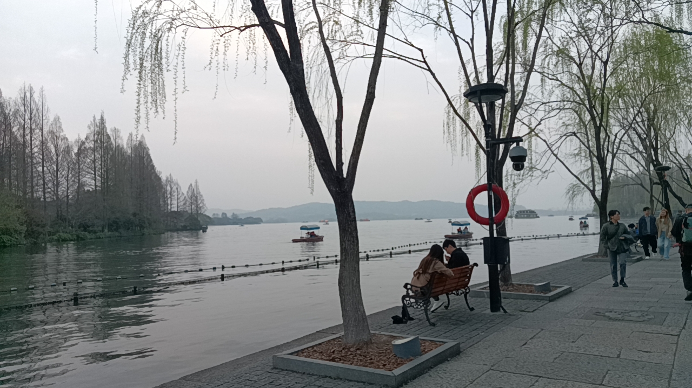

杭州 / 西湖 / 复试结束以后 · 一个人坐了很久。

春天的西湖边挺清冷的。

没有特别热闹。

周围零零散散有一些路人走过。

我就一个人坐在那里。

湖在前面。

风吹过来。

那段时间一直绷着的东西，好像突然一下子全部掉下去了。

考研。

初试。

准备复试。

坐车。

紧张。

焦虑。

反复想：

到底能不能上？

然后那一刻，我突然什么都不想管了。

不想复盘自己的表现。

不想猜排名。

不想想未来。

也不想再努力证明什么。

我只是坐在那里。

看着湖。

看着偶尔经过的人。

然后心里特别清楚地冒出来一句：

**终于结束了。**

那是我大学四年里少数真正感觉：

什么都不用想了。

的时刻。

那种如释重负，我到现在都记得。

  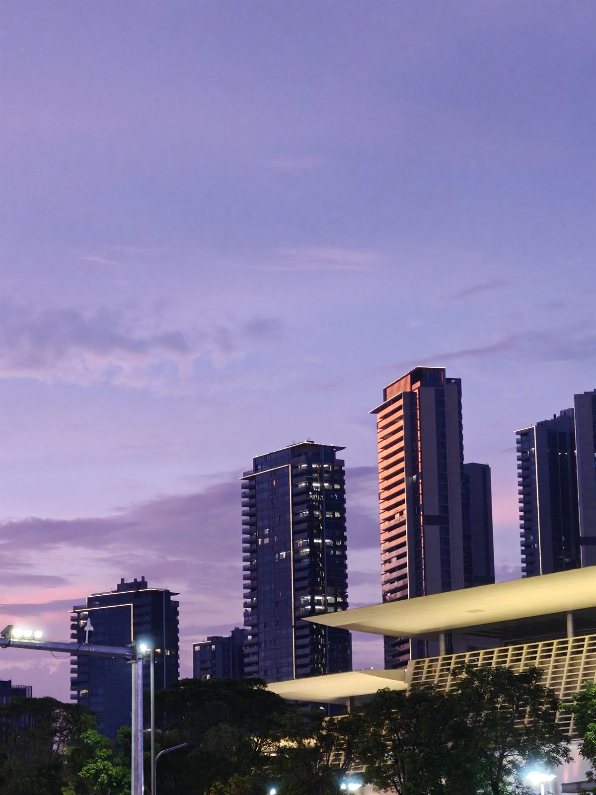

圈圈家乡的晚霞。

---

后来，我真的拿到了录取消息。

那一刻当然很开心。

但我现在不太愿意把整个考研写成什么：

“经过长期坚持，最终成功上岸。”

的励志故事。

因为我自己知道。

我没有那么完美。

我摸过鱼。

摆过烂。

打过很多游戏。

焦虑的时候会刷手机。

备考也没有达到自己心目中那个理想的状态。

甚至考上的时候，我自己都会想：

好像多少有点擦线混过去了。

但结果就是：

我跌跌撞撞地走过来了。

有时候靠努力。

有时候靠运气。

有时候靠朋友。

有时候靠家人。

然后居然也真的走到了这里。

所以现在反而觉得：

人的人生好像不需要每一步都走得特别漂亮。

能够走过去。

可能本身就已经挺好了。

---

## 八、2026年6月8号

然后就到了毕业季。

论文。

材料。

手续。

照片。

聚餐。

告别。

以前天天待着觉得烦的校园，突然开始变得舍不得。

以前觉得普通得不能再普通的路，因为知道以后不会再天天走了，一下子就变得不一样。

人真的很奇怪。

拥有的时候觉得理所当然。

快失去的时候，才突然开始认真看。

---

2026年6月8号。

我穿上学士服，站在人群里拍毕业照。

四年前那个坐着大巴第一次进城的男生，好像还在昨天。

四年前的我。

连 Python 里的 `=` 和 `==` 都搞不懂。

会因为一道简单的题怀疑人生。

会在恋爱里笨拙得手足无措。

会因为别人比自己厉害而自卑。

会沉迷游戏。

会逃课。

会焦虑。

会以为大学四年真的特别特别长。

然后突然有一天。

有人喊：

“毕业快乐。”

我才意识到：

哦。

真的结束了。

---

但大学并没有像我以前想象的那样，在毕业的时候突然把我变成一个成熟的人。

没有。

我现在还是会懒。

还是会拖延。

还是会优柔寡断。

还是会胡思乱想。

会喜欢一个人以后反复分析她的消息。

会因为打游戏输给朋友而急眼。

会因为别人某些生活习惯而产生傲慢和偏见。

会跟舍友闹矛盾。

会在和父母意见不同的时候，嘴上说着：

“我都这么大了，不要管我啦。”

真正做决定的时候还是会下意识看看他们的脸色。

会在晚上突然想起以前的事情。

想起前女友。

想起一些没有说好的话。

想起某些自己做得不够好的瞬间。

然后开始审判自己。

  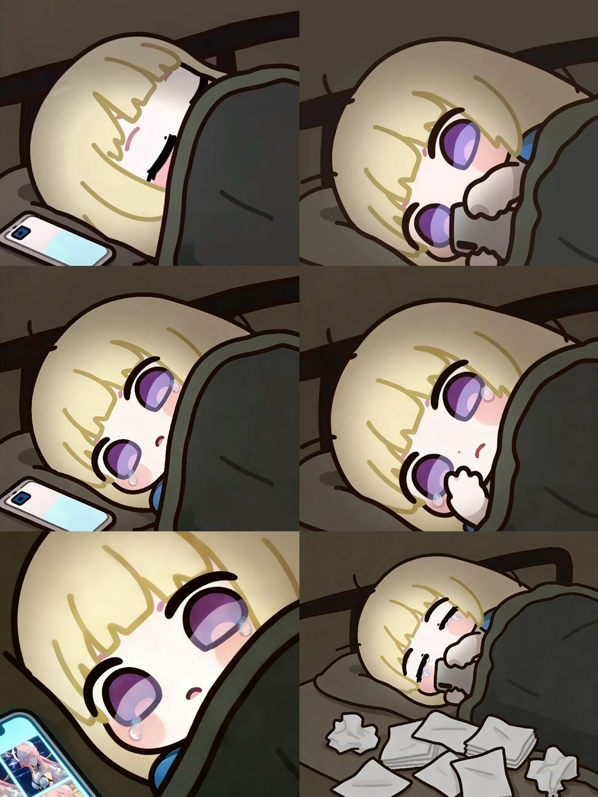

当时过 IMS 的剧情……

大学四年没有治好这些东西。

甚至可能正是在毕业以后，我才第一次真正开始看清它们。

---

可是现在我慢慢觉得：

“我就是个烂人。”

其实是一句很偷懒的话。

因为一个人并不是一个形容词。

我是那个沉迷游戏的我。

也是为了一个问题查几个小时的我。

我是面对喜欢的人支支吾吾的我。

也是后来愿意认真表达感情的我。

我是优柔寡断、害怕做错选择的我。

也是坐在西湖边，终于走完一段路的我。

我是傲慢的。

也是慢慢学会认真听别人讲话的。

我是懒惰的。

也是曾经在晚上十点的星空下面，跟着朋友继续备考的。

我是那个连 `=` 和 `==` 都分不清的笨蛋。

也是后来终于可以一点点自己解决问题的人。

我是被老师说过：

“你太菜了吧。”

的那个学生。

也是现在终于开始明白：

**菜就去练，人生最后还是得自己负责。**

人好像本来就是由这些互相矛盾的东西拼起来的。

---

## 九、人生中一场漫长的暑假

如果一定要让我给大学四年找一个形容。

我现在最喜欢的说法大概是：

**它是我人生里为数不多的一场，让我真正陶醉过的漫长暑假。**

小时候的暑假好像永远不会结束。

七月刚开始的时候，会觉得：

还有好久。

早上醒来。

电视开着。

游戏开着。

朋友在外面喊你。

时间多得好像根本花不完。

所以你从来不会认真去想：

九月份终究是会来的。

大学也差不多。

大一结束的时候：

还有三年呢。

大二结束：

还有两年。

到了大三：

好像有点快。

然后突然有一天。

毕业照已经拍完了。

行李开始收拾。

  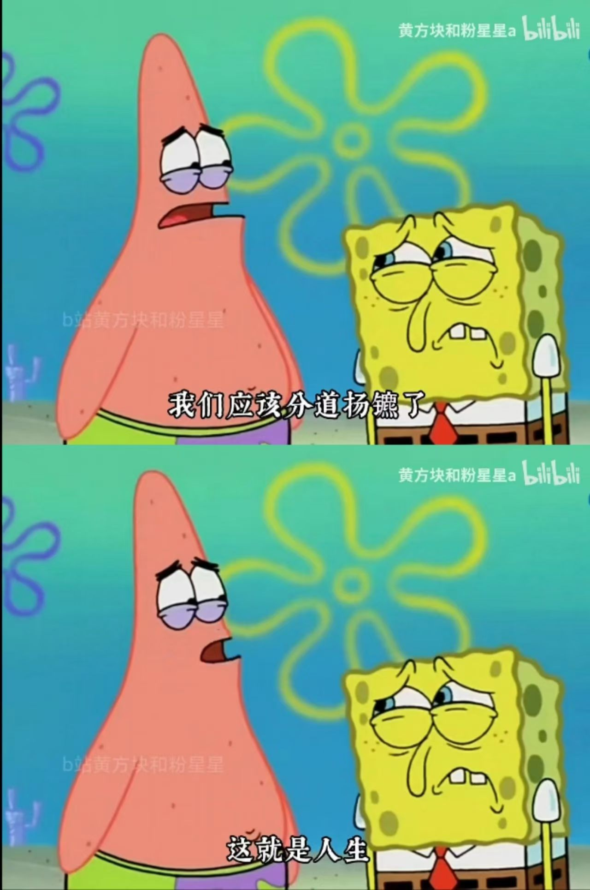

离别的种子，早在相遇的那一刻埋下。

朋友开始离开。

有人说：

“以后有机会再见。”

你才突然意识到：

原来暑假已经结束了。

---

以前我总觉得青春应该很轰轰烈烈。

应该有很多传奇的经历。

很多成功。

很多疯狂。

很多值得拿出来吹一辈子的故事。

现在才发现。

我的青春好像并没有那么传奇。

它只是由很多很普通的东西组成。

喜欢过的人。

错过的人。

没有做好的项目。

没有考好的考试。

打过的游戏。

参加过的比赛。

拿到过的一些奖。

凌晨还亮着的电脑屏幕。

教室。

宿舍。

食堂。

老师。

妹妹发来的数学题。

波波腼腆的样子。

圈圈一起备考的背影。

邓同学和阿伟那些让我慢慢学会认真思考的话。

一个很自律的女生。

黄老师带来的压迫感。

bt 老师那句：

“你太菜了吧。”

还有晚上十点的星空。

以及复试结束以后，一片清冷的西湖。

  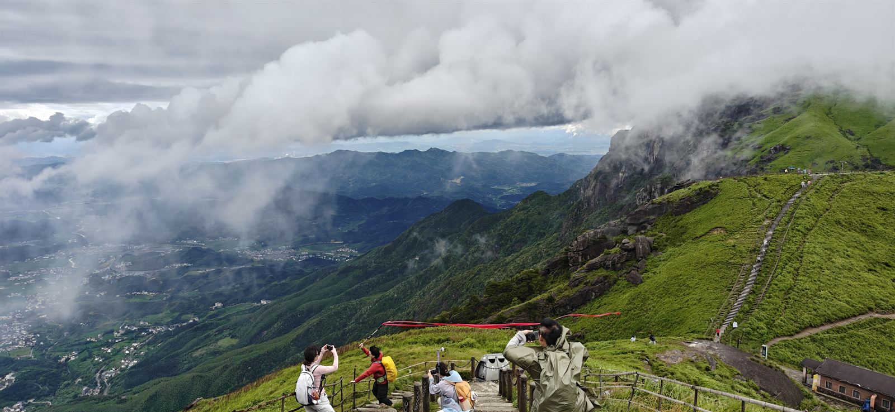

武功山风景甚好！

---

有很多遗憾。

有很多人，我本来可以和他们更熟一点。

有很多事情，我本来可以做得更好。

有很多时间，我确实浪费掉了。

有些人，如果当时的我成熟一点，也许结局会不一样。

有些选择，如果当时再坚持一点，也许会走到另外一个地方。

但是现在真让我回到2022年，重新再来一次，我又不知道自己是不是真的能够做得更好。

十八岁的我，本来就只能拥有十八岁的认知。

二十岁的我，也只能跌跌撞撞地学习怎么长大。

所以现在再看那些事情。

除了后悔以外。

好像也多了一点理解。

---

如果很多年以后，有人问我：

“你的大学怎么样？”

我大概不会说：

我特别成功。

也不会说：

我大学四年特别努力。

我可能会先想一会儿。

然后笑一下。

说：

**挺好的。**

真的。

挺好的。

有过喜欢的人。

有过很好的朋友。

有过一些特别善良的人。

有过星空。

有过游戏。

有过焦虑。

有过争吵。

有过遗憾。

也有过一个人坐在西湖边，什么都不用想的下午。

有那么几年。

我每天都能够见到一群以后也许再也不会天天见到的人。

我们一起上课。

一起打游戏。

一起骂老师。

一起准备考试。

一起聊天。

一起在根本不知道未来在哪里的时候，装作未来还很远。

现在想想。

那真的已经很好了。

---

2026年6月8号以后。

我的大学结束了。

但我的人生当然还没有。

我还要继续读书。

还要工作。

还要挣钱。

还会认识新的朋友。

还会喜欢上新的人。

大概还会犯很多傻。

还会焦虑。

还会拖延。

还会在一些时候怀疑自己。

我也不知道以后到底会不会赚很多很多的钱，会不会成为别人眼里很厉害的人，会不会拥有一个多么光鲜亮丽的人生。

可能都不会。

好像也没什么。

我只是希望很多很多年以后，再重新看到2026年6月8号那张毕业照时，不会觉得：

照片里的那个年轻人，后来彻底放弃了自己。

如果能够做到这一点。

那么大学四年里那些打过的游戏、走过的弯路、喜欢过的人、错过的人、熬过的夜、犯过的傻、掉过的眼泪，还有看过的星空——

大概也就都没有白费。

我的大学结束了。

我的那场漫长暑假，也终于结束了。

只是偶尔回头的时候。

我想我还是会很想它。

很想很想。

因为那个暑假，

以后大概真的不会再有了。

🗡️ 🎓 🔥 🎓 ✨ 
<strong>Graduation Achieved</strong>

